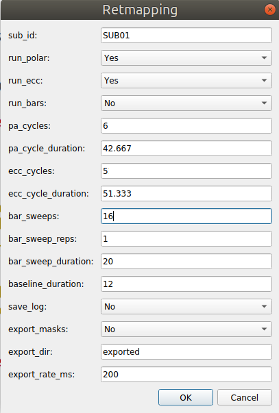

# psychopy-retinotopy
Psychopy experiment for running Polar, Eccentricity and Bars checkerboard
stimuli during an fmri experiment.

Once the experiment is started, you will see a setup dialog where you can
specify what experiment to run:

Below is how I would set it up to simultaneously collect polar angle (pa) and
eccentricity (ecc) maps. This means there will be a pa wedge (in this case it
will go around 6 times, taking 42.667 seconds per revolution) and an ecc ring
(expanding from the center to the periphery 5 times, taking 51.333 seconds
per expandsion). Note that 6 * 42.667 = 256.002 and 5 * 51.333 = 256.665. The
are approximately the same length and so we don't have the issue where one
completes before the other.

Since we did not ask to run bars, the number of bar sweeps/reps/durations
doesn't matter.

The baseline will be 12 seconds at the beginning and end of the run.

Saving the log is not really needed once you know what all your timings are
going to be (and assuming you keep that the same for every subject).

Exporting masks is a special mode **NOT TO BE USED WHILE SCANNING**. Instead,
this is a way to take a lot of screenshots which can later be used to fit pRFs
where we need to know what area of the visual field was stimulated along with
precisely when it was stimulated - a log of the timings, along with the
screenshots will be saved in a folder called 'export'. It will slow down the
script quite a bit and so take longer to finish (but the timings in the log
take this into account).

Here is an example of what the subject will see:

And this is how it looks when doing bars:

