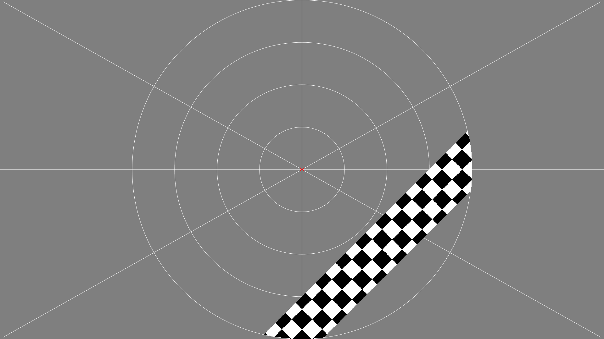

# psychopy-retinotopy
Psychopy experiment for running Polar, Eccentricity and Bars checkerboard stimuli during an fmri experiment.

Once the experiment is started, you will see a setup dialog where you can specify what experiment to run:

Above is how I would set it up to simultaneously collect polar angle (pa) and eccentricity (ecc) maps. This means there will be a pa wedge (in this case it will go around 6 times, taking 42.667 seconds per revolution) and an ecc ring (expanding from the center to the periphery 5 times, taking 51.333 seconds per expansion). Note that 6 * 42.667 = **256.002** and 5 * 51.333 = **256.665**. They are approximately the **same length** and so we don't have the issue where one completes before the other.

Since we did not ask to run bars, the number of bar sweeps/reps/durations doesn't matter here.

The baseline will be 12 seconds at the beginning and end of the run. This means our run will be 256 + 24 seconds = 4.66 minutes 

Saving the log is not really needed once you know what all your timings are going to be (and assuming you keep that the same for every subject).

Exporting masks is a special mode **NOT TO BE USED WHILE SCANNING**. Instead, this is a way to take a lot of screenshots (one every 200ms) to know what area of the visual field was stimulated along with precisely when it was stimulated - which can later be used to fit pRFs (see the [matlab-fmri-libraries repository](https://github.com/Goffaux-Lab/matlab-fmri-libraries)) where we need - a log of the timings, along with the screenshots themselves will be saved in a folder called 'export'. It will slow down the script quite a bit and so take longer to finish (but the timings in the log take this into account).

Here is an example of what the subject will see when doing polar angle and eccentricity at the same time:

And this is how it looks when doing bars:

